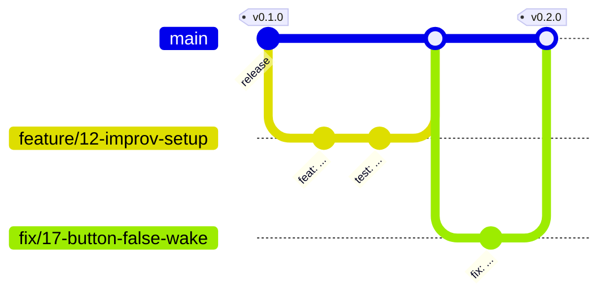
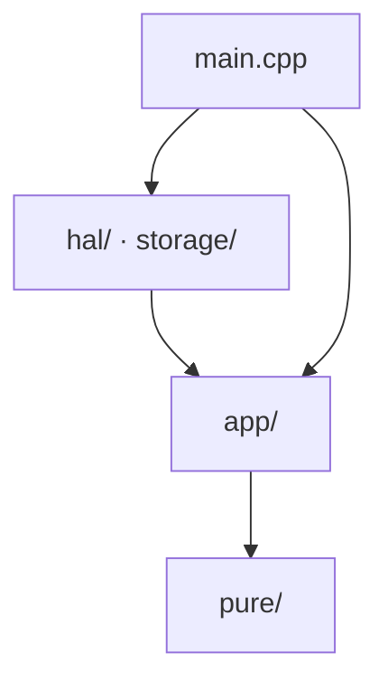

# Contributing

How a change gets into this repository: small, named well, tested, reviewed.

Building, flashing and testing: [OPERATIONS.md](OPERATIONS.md).

## Workflow

Until v0.1 work goes straight to `main`. From v0.1 on, every change follows the same path:



| Step | What | Why |
| --- | --- | --- |
| 1. Issue | Describe the bug or feature (templates provided) | Agree on the "what" before writing the "how" |
| 2. Branch | From an up-to-date `main`, named after the issue | `main` only ever holds reviewed, working code |
| 3. Commits | Small steps that each build and pass the tests | Easy to review, easy to undo |
| 4. Pull request | Into `main`; write `Closes #12` to link the issue | The record of what changed and how it was tested |
| 5. Review | CI green, owner approves | A second pair of eyes |
| 6. Merge | Then delete the branch | |

## Names

A good name removes the need for a comment. One convention per kind of thing:

| Thing | Convention | Example |
| --- | --- | --- |
| Function | `camelCase`, starts with a verb | `planSleepSeconds()`, `buildScreenUrl()` |
| Variable, field | `camelCase` noun | `wakeCount`, `shownScreen` |
| Yes/no value or function | Reads as a statement | `isRtcStateValid()`, `lowBattery`, `cycleSucceeded` |
| Number with a unit | Unit as suffix | `timeoutMs`, `sleepSeconds`, `kLowBatteryOnPercent` |
| Type (`struct`, `class`, `enum class`) | `PascalCase` noun | `RtcState`, `NavAction` |
| Interface (port) | `I` + what the app needs | `IDisplay`, `IScreenClient` |
| Adapter, fake | Named after the technology; `Fake` + port | `EpaperDisplay`, `FakeDisplay` |
| Constant | `k` + `PascalCase` | `kFrameBytes`, `kPinKey1` |
| Global (rare) | `g_` prefix | `g_frame` |
| Macro, build flag | `EPB_` + `UPPER_CASE` | `EPB_SERVER_URL` |
| Namespace | lower case | `epb`, `epb::config` |
| File | `snake_case`, named after the idea; `.h` + `.cpp` pair | `sleep_plan.h`, `sleep_plan.cpp` |
| Test file | `test_<topic>.cpp` | `test_battery_math.cpp` |
| Test | A sentence that states the expected behaviour | `http_date_rejects_malformed_input` |
| Branch | `<kind>/<issue>-<short-name>`; kind is `feature`, `fix` or `chore` | `fix/17-button-false-wake` |
| Commit | `<type>: <what changed>`, see below | `fix: keep old screen when download fails` |
| Version tag | `vMAJOR.MINOR.PATCH` ([Semantic Versioning](https://semver.org)) | `v0.1.0` |

### Commit messages

[Conventional Commits](https://www.conventionalcommits.org):

```
<type>: <what changed, in the imperative, no full stop>

<optional body: why, and anything a reader of the history should know>
```

| Type | For | Type | For |
| --- | --- | --- | --- |
| `feat` | A new capability | `refactor` | Restructuring, same behaviour |
| `fix` | A bug fix | `build` | Build system, dependencies, CI |
| `docs` | Documentation only | `chore` | Everything else |
| `test` | Tests only | | |

## Code rules

### Layers



An arrow means "may include". Arrows only point down.

| Folder | May include | Must not include |
| --- | --- | --- |
| `pure/` | C++ standard library, other `pure/` headers | anything else |
| `app/` | `pure/`, other `app/` headers | Arduino, ESP-IDF, `hal/`, `storage/` |
| `hal/`, `storage/` | Arduino, ESP-IDF, `app/`, `pure/` | each other, unless there is a good reason |
| `main.cpp` | everything | |

**A decision belongs in `pure/` or `app/`. Anything that touches a pin belongs in `hal/`.** New hardware gets an interface in `app/ports.h`, an adapter in `hal/` and a fake in `tests/host/fakes.h`.

The host test build enforces the first two rows: it compiles `pure/` and `app/` with no Arduino headers available.

### Rules, and why

| Rule | Why |
| --- | --- |
| One function, one job | It can be named, tested and reused |
| No bare numbers in logic; name them in `config.h` or next to their use | The name says what, the comment says why that value |
| GPIO numbers only in `hal/board.h` | One place to change when the hardware changes |
| Every wait on the outside world has a timeout | A hang with the radio on empties the battery |
| Failure is reported through the return value; no exceptions, no RTTI | Smaller binary, visible error paths |
| No heap allocation in the wake cycle | Memory use is known at build time |
| Check data where it enters or leaves the program | Inner code can trust its inputs |
| Let the compiler check: `constexpr`, `static_assert`, warnings as errors | A mistake found at build time costs nothing |
| No secrets in the repository; `secrets.h` stays ignored by git | History cannot be unpublished |
| C++17, formatted by `clang-format`, never by hand | Formatting is not a review topic |

```sh
find firmware/src firmware/tests firmware/include \( -name '*.h' -o -name '*.cpp' \) | xargs clang-format -i
```

### Comments teach, briefly

This code is written to be read by someone who is learning.

1. Mark an idea where it is used: `PATTERN:`, `ALGORITHM:` or `TECHNIQUE:`, its name, what it is, why here. Two to four lines.
2. Add a row to [docs/PATTERNS.md](docs/PATTERNS.md) if it is new.
3. Explain an idea once; elsewhere, point to that place.
4. A small diagram beats a paragraph.
5. Do not narrate the code (`i++  // increase i`). Do write down the reason, the trap, and what was learned the hard way on the hardware.

```cpp
// PATTERN: hysteresis. Two thresholds stop the flag from flickering when the
// battery hovers around one value. In between, it keeps its previous value.
//
//   percent:  0 ...... 8 | 9  10  11 | 12 ...... 100
//   flag:        low     |   keep    |    not low
```

## Tests

- A change to `pure/` or `app/` comes with tests in `firmware/tests/host/`.
- A bug fix starts with a test that fails because of the bug.
- What cannot be unit tested is checked on the board; say what you checked in the pull request.

Before asking for review:

```sh
cmake -S firmware/tests/host -B build/host-tests && cmake --build build/host-tests
ctest --test-dir build/host-tests --output-on-failure
(cd firmware && pio run)
```

## Definition of done

- [ ] Builds without warnings in project code
- [ ] Unit tests pass; new logic has new tests
- [ ] Formatted with `clang-format`
- [ ] Patterns and algorithms are commented and listed in `docs/PATTERNS.md`
- [ ] Docs updated where behaviour changed (`README`, `OPERATIONS`, `docs/`)
- [ ] `CHANGELOG.md` has a line under "Unreleased"
- [ ] Tested on the board if it touches `hal/`, `storage/` or `main.cpp`

## Third-party code and licenses

The project is [MIT licensed](LICENSE); contributions are released under the same license.

Do not copy code from other projects without checking its license. Some projects this one learned from are GPL-licensed or have no license. Ideas and hardware facts are free to use; code is not. When in doubt, write it yourself and credit the inspiration in the README.
