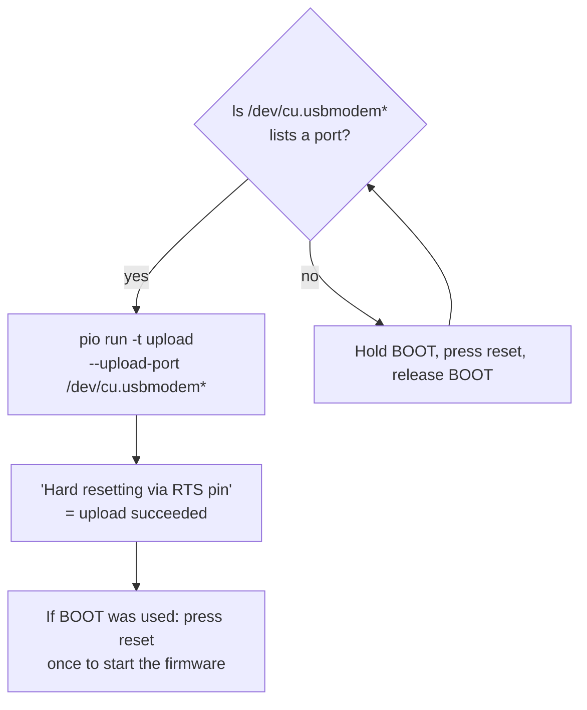

# Operations

How to build, test, flash, run and release the firmware. Commands are for macOS; Linux differs only in the package manager.


1. [Install the tools](#1-install-the-tools)
2. [Run the unit tests](#2-run-the-unit-tests)
3. [Configure Wi-Fi and server](#3-configure-wi-fi-and-server)
4. [Build, flash and watch the log](#4-build-flash-and-watch-the-log)
5. [First run on the hardware](#5-first-run-on-the-hardware)
6. [Putting the repository on GitHub](#6-putting-the-repository-on-github)
7. [Releasing a version](#7-releasing-a-version)
8. [Updating a pinned dependency](#8-updating-a-pinned-dependency)
9. [Troubleshooting](#9-troubleshooting)

## 1. Install the tools

Only PlatformIO is required. It needs Python 3.10 to 3.14 (`python3 --version`). Its installer works in your home folder, without administrator rights:

```sh
cd ~
curl -fsSL -o get-platformio.py https://raw.githubusercontent.com/platformio/platformio-core-installer/master/get-platformio.py
python3 get-platformio.py
echo 'export PATH="$HOME/.platformio/penv/bin:$PATH"' >> ~/.zshrc   # so every new Terminal finds `pio`
source ~/.zshrc
pio --version
```

- If macOS asks to install the "command line developer tools", accept (or run `xcode-select --install`). They bring `git` and the C++ compiler.
- With [Homebrew](https://brew.sh): `brew install platformio cmake clang-format` does the same and adds the optional tools.

| Tool | Needed | Used for |
| --- | --- | --- |
| PlatformIO Core (`pio`) | yes | Build and flash. Downloads compiler and libraries on first use. |
| git | yes | Fetches the display library; supplies the firmware version. |
| C++ compiler (`c++`) | for unit tests | Part of Apple's command line developer tools. |
| CMake | optional | The standard way to build the unit tests. |
| clang-format | optional | Formatting, when you change code. |

Editor: VS Code with the PlatformIO IDE extension. Open the **`firmware/`** folder, where `platformio.ini` is. The Arduino IDE is not used for this firmware.

## 2. Run the unit tests

No board needed. From the repository root:

```sh
cmake -S firmware/tests/host -B build/host-tests
cmake --build build/host-tests
ctest --test-dir build/host-tests --output-on-failure
```

`./build/host-tests/host_tests` lists each test by name.

Without CMake (no extra warnings, no sanitizers):

```sh
c++ -std=c++17 -Ifirmware/src -Ifirmware/tests/host \
    firmware/src/pure/*.cpp firmware/src/app/*.cpp firmware/tests/host/*.cpp \
    -o /tmp/host_tests && /tmp/host_tests
```

Sanitizers are run-time checks for memory errors. If your compiler lacks them, add `-DEPB_SANITIZE=OFF` to the first command.

## 3. Configure Wi-Fi and server

Three settings: Wi-Fi name, Wi-Fi password, server address. Until proper setup exists they are compiled in from a file that git ignores:

```sh
cd firmware
cp include/secrets.example.h include/secrets.h    # then edit it
```

On its next start the board copies the values into its settings storage.

- `git status` must never show `secrets.h`.
- A firmware `.bin` built with `secrets.h` contains your Wi-Fi password. Do not share it.
- Without `secrets.h` the firmware builds and shows "Setup needed".

## 4. Build, flash and watch the log

From the `firmware/` folder:

| Goal | Command |
| --- | --- |
| Build | `pio run` |
| Build and flash | `pio run -t upload` |
| Watch the serial log | `pio device monitor` |
| Flash, then watch | `pio run -t upload -t monitor` |
| Debug build: waits 2 s at each wake so the log is complete | `pio run -e xiao-epaper-debug -t upload -t monitor` |
| Erase everything, stored settings included | `pio run -t erase` |
| Delete build output | `pio run -t clean` |

The first build downloads the toolchain and takes minutes. Later builds take seconds.

**When the upload cannot connect.** A sleeping board has no USB connection.



- **BOOT** is the tiny button on the XIAO module, next to the USB-C socket.
- Use a USB-C cable that carries data. Charge-only cables look the same.

**Reading the log.** Each line starts with the milliseconds since the wake began, so the log is also a timing profile:

```
[  2012 ms] e-paperBoard firmware v0.1.0
[  2040 ms] wake #1: reason=boot screen=home battery=3940 mV (68%)
[  3310 ms] wifi: connected, ip=192.168.1.57 rssi=-58 dBm        1.3 s to join Wi-Fi
[  7950 ms] drew screen 'home'                                    4.6 s for download + refresh
[  7951 ms] sleeping for 1800 s
```

(Illustrative numbers.) The board leaves USB when it sleeps and returns when it wakes; the monitor reconnects by itself.

## 5. First run on the hardware

For a new board, or after a change to the hardware layer:

1. Run the unit tests (section 2).
2. Start the test server on a computer in the same Wi-Fi network: `python3 tools/test_server.py`. Allow incoming connections if macOS asks.
3. Put the address it prints into `secrets.h` as `EPB_SERVER_URL`.
4. Flash the debug build and watch the log.

The test image, and what each mark proves:

```
+------------------------------+    frame        all 800 x 480 pixels arrive
| #                            |    # corner     orientation: must be top-left
|                              |    row of N     which screen: home = 1, next = 2, ...
|   [] [] []                   |    white        colours are not inverted
+------------------------------+
```

| Check | Expected |
| --- | --- |
| Boot | A version line, then `wake #1` with a plausible battery voltage |
| Wi-Fi | `wifi: connected` |
| Download and draw | The test image with one square in the row, then `sleeping for 120 s` |
| Timer wake | Two minutes later: `reason=timer`, `screen unchanged (304)`, no flash on the panel |
| Keys | Left `reason=home`, middle `next`, right `prev`; the number of squares changes |
| Fast reconnect | From the second wake: `wifi: fast connect on channel N` |
| Failure handling | Stop the server, press a key: `cycle failed`, old image stays, retry in 60 s, then 120 s |
| On battery | On-off switch on, USB unplugged, press a key: same behaviour |
| No settings | Erase the board, flash a build without `secrets.h`: "Setup needed" appears once |

Write down what does not match. Those findings are the work list for v0.1.

## 6. Putting the repository on GitHub

```sh
git add -A
git status                      # secrets.h and .pio/ must NOT be in the list
git commit -m "feat: firmware skeleton"

git remote add origin git@github.com:<user>/e-paperBoard.git
git fetch origin

# Only if the GitHub repository already has commits (a README made on the website).
# The two histories share no commit, so git wants to be told the merge is intended.
git merge origin/main --allow-unrelated-histories

git push -u origin main         # -u: remember the upstream branch
```

Then check the **Actions** tab on GitHub: the CI workflow runs there for the first time.

## 7. Releasing a version

Versions follow [Semantic Versioning](https://semver.org): `vMAJOR.MINOR.PATCH`. "v0.1" is the tag `v0.1.0`.


```sh
git tag -a v0.1.0 -m "v0.1.0"
git push origin main --follow-tags
```

The firmware takes its version from the tag: built exactly at the tag it reports `v0.1.0`; three commits later, `v0.1.0-3-g<commit>`.

## 8. Updating a pinned dependency

All versions are fixed in `firmware/platformio.ini`.

1. Change the version (platform URL or library commit hash).
2. `pio run -t clean`, then `pio run`.
3. Repeat the first-run checklist, at least display and sleep.
4. Note the update in `CHANGELOG.md`.

## 9. Troubleshooting

**Upload and serial port**

| Symptom | Cause and fix |
| --- | --- |
| Upload tries a port that is not the board (such as `/dev/cu.SomeHeadphones`), then "No serial data received" | No USB port for the board was found, so PlatformIO picked another one. Follow the diagram in section 4. |
| No serial port at all | The board is asleep, or the cable is charge-only. BOOT sequence; another cable. |
| Upload succeeded after BOOT, but nothing happens | The board is still in download mode. Press reset once. |
| Log starts in the middle or is empty | USB reconnects after each wake and early lines are lost. Use the `xiao-epaper-debug` build. |

**Build**

| Symptom | Cause and fix |
| --- | --- |
| `ERROR: Python version must be ...` | The ESP32 platform supports Python 3.10 to 3.14. |
| The same error, only at "Looking for upload port" | An older ESP32 platform is still installed and rejects your Python. Delete its folder in `~/.platformio/platforms/`. |
| `undefined reference to EPaper::...` | The display library was built without `driver.h`. `-I include` must be in `build_flags`. |
| "program size is greater than maximum" | The firmware outgrew its 3 MB slot (`partitions.csv`). |
| Unit tests: sanitizer errors while building | Configure with `-DEPB_SANITIZE=OFF`. |
| Unit tests: build stops on a warning | Your compiler knows a newer warning. Configure with `-DEPB_WERROR=OFF` and report it. |

**On the board**

| Symptom | Cause and fix |
| --- | --- |
| Works on USB, dead when unplugged | The on-off switch is off. It connects the battery. |
| "Setup needed" on the panel | No settings stored. Create `secrets.h` (section 3) and flash again. |
| `wifi: could not join` | Wrong name or password, or a 5 GHz-only network. The ESP32 speaks 2.4 GHz only. |
| `http: request failed (connection refused)` | Wrong address or port, server not running, or a firewall on the computer. |
| `http: body is -1 bytes` | The server sent no `Content-Length`. It must. |
| Panel stays blank after "drew screen" | Ribbon cable not seated. Power off before touching it. |
| Wakes again right after sleeping, over and over | A key is stuck or its pin floats. Check `reason=` in the log; see the pull-up notes in `hal/power.cpp`. |
| `AWAKE LIMIT reached` | Something hung for 90 s. The lines before it show where. |
