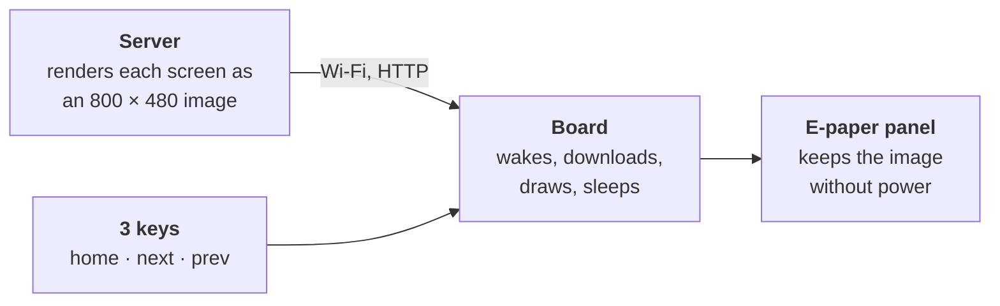
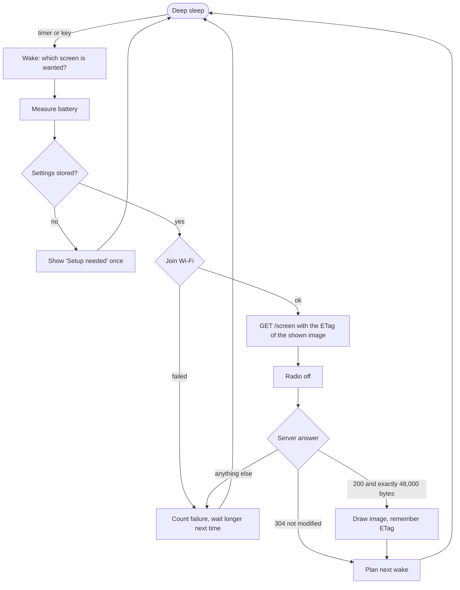

# e-paperBoard

Firmware for a battery-powered 7.5" e-paper wall display: weather, a to-do list, a family calendar.



The board does very little on purpose: the less time it spends awake, the longer the battery lasts.

**An educational project.** Every pattern and algorithm is named and explained where it is used, and indexed in [docs/PATTERNS.md](docs/PATTERNS.md). The source is meant to be read.

> **Status: skeleton, before v0.1.** The firmware compiles, its logic is unit tested, and the whole wake cycle has run on the hardware, on USB and on battery. Details: [What is verified](#what-is-verified).

## Hardware

| Part | Detail |
| --- | --- |
| Kit | Seeed Studio TRMNL 7.5" (OG) DIY Kit |
| Controller | XIAO ESP32-S3 Plus (16 MB flash, OPI PSRAM) on the XIAO ePaper Display Board EE04 |
| Display | 7.5" monochrome e-paper, 800 × 480, UC8179 controller |
| Input | 3 keys: home, next, prev (left to right) |
| Power | 2000 mAh Li-ion battery, charged over USB-C |

Pins and handling: [docs/HARDWARE.md](docs/HARDWARE.md).

## How it works

The board is asleep almost all the time. A timer or a key wakes it, it runs one short **wake cycle**, and it sleeps again.



## Where to start reading

| Step | Read | You get |
| --- | --- | --- |
| 1 | [docs/ARCHITECTURE.md](docs/ARCHITECTURE.md) | The design in pictures |
| 2 | [`firmware/src/app/wake_cycle.cpp`](firmware/src/app/wake_cycle.cpp) | The whole behaviour, in one function |
| 3 | [`firmware/src/pure/`](firmware/src/pure) | Small algorithms, one idea per file, each with tests |
| 4 | [docs/PATTERNS.md](docs/PATTERNS.md) | Every idea by name, with a pointer into the code |
| 5 | [docs/SERVER_CONTRACT.md](docs/SERVER_CONTRACT.md) | What the server must send |

## Repository layout

```
e-paperBoard/
├── README.md, CONTRIBUTING.md, OPERATIONS.md, CHANGELOG.md, LICENSE
├── docs/                 architecture, patterns, server contract, hardware
├── firmware/
│   ├── platformio.ini    build configuration (all versions pinned)
│   ├── partitions.csv    flash layout
│   ├── boards/           board definition for the XIAO ESP32-S3 Plus
│   ├── include/          driver.h (display config), secrets.example.h
│   ├── scripts/          firmware version from git
│   ├── src/
│   │   ├── main.cpp      wires everything together
│   │   ├── config.h      timeouts and other tunable numbers
│   │   ├── pure/         maths and rules, no hardware     (unit tested)
│   │   ├── app/          the wake cycle, no hardware      (unit tested)
│   │   ├── hal/          adapters: display, Wi-Fi, HTTP, battery, sleep
│   │   └── storage/      settings in flash (NVS)
│   └── tests/host/       unit tests that run on your computer
├── tools/test_server.py  stand-in server with test images
└── .github/              CI workflow, issue and pull request templates
```

The firmware has its own folder so the server and the case design can join later.

## Quick start

Installing the tools and everything else: [OPERATIONS.md](OPERATIONS.md).

Unit tests (no board needed):

```sh
cmake -S firmware/tests/host -B build/host-tests
cmake --build build/host-tests
ctest --test-dir build/host-tests --output-on-failure
```

Build and flash:

```sh
cd firmware
cp include/secrets.example.h include/secrets.h   # then edit: Wi-Fi name, password, server address
pio run -t upload
pio device monitor
```

## What is verified

| Check | State |
| --- | --- |
| Unit tests of `pure/` and `app/`: 65 tests, with sanitizers | pass |
| Firmware build, both environments, no warnings in project code | pass, 1.05 MB of the 3 MB slot |
| Static analysis (cppcheck) of `pure/` and `app/` | clean |
| On the board (2026-10-05): boot, battery reading, settings from `secrets.h` | works |
| Wi-Fi connect, and the faster reconnect on later wakes | works |
| Server down: failure counted, retry after 60 s, then 120 s | works |
| Deep sleep, wake by timer, state kept across sleep | works |
| Download and draw; `304` leaves the panel untouched | works |
| Wake by key: home, next, prev, with wrap-around | works |
| Image orientation and colours | correct |
| On battery, USB unplugged | works |
| "Setup needed" notice on a board without settings | not tested yet |
| Sleep current | not measured |
| CI workflow on GitHub | first run not checked yet |

## Roadmap

**v0.1 (this skeleton, proven on hardware)**
- [x] Flash and run on the board
- [x] Deep sleep and wake by timer
- [x] A minimal test server that serves 48,000-byte images
- [x] Download and draw an image
- [x] Wake by key; each key does what the layout says (home, next, prev)
- [x] Run on battery with USB unplugged
- [ ] Tag `v0.1.0`

**After v0.1** (each as an issue, a branch and a pull request)
- Wi-Fi setup from the browser over USB (Improv Serial) and a setup portal
- Over-the-air firmware updates (the two firmware slots already exist)
- HTTPS
- Long-press gestures; debug screen
- Partial refresh for small regions
- Docked mode: stay awake while on the charger
- Offline cache of recent screens on the FAT partition

## Acknowledgements

No code was copied from these projects. They were studied for ideas and hardware facts.

- [Pala One firmware](https://github.com/PaulLagier/pala-one-firmware) by Paul Lagier: deep sleep, battery reading, project structure.
- [E-Ink Desk Display](https://www.huyvector.org/smart-devices/e-ink-desk-display) by Huy Vector, based on FlintOS by Ameya Angadi: pin map, build settings and refresh limits for this kit.
- [eink-desk-display](https://github.com/davidz-yt/eink-desk-display) by davidz-yt: rendering and layout ideas for the server.
- [Seeed_GFX](https://github.com/Seeed-Studio/Seeed_GFX) by Seeed Studio: the display driver library.

## License

[MIT](LICENSE): use, change and share the code, also commercially, as long as the copyright notice and license text stay with it. No warranty.

The libraries are downloaded at build time and keep their own licenses: Seeed_GFX (MIT and BSD), Arduino core for ESP32 (LGPL-2.1), ESP-IDF (Apache-2.0).
