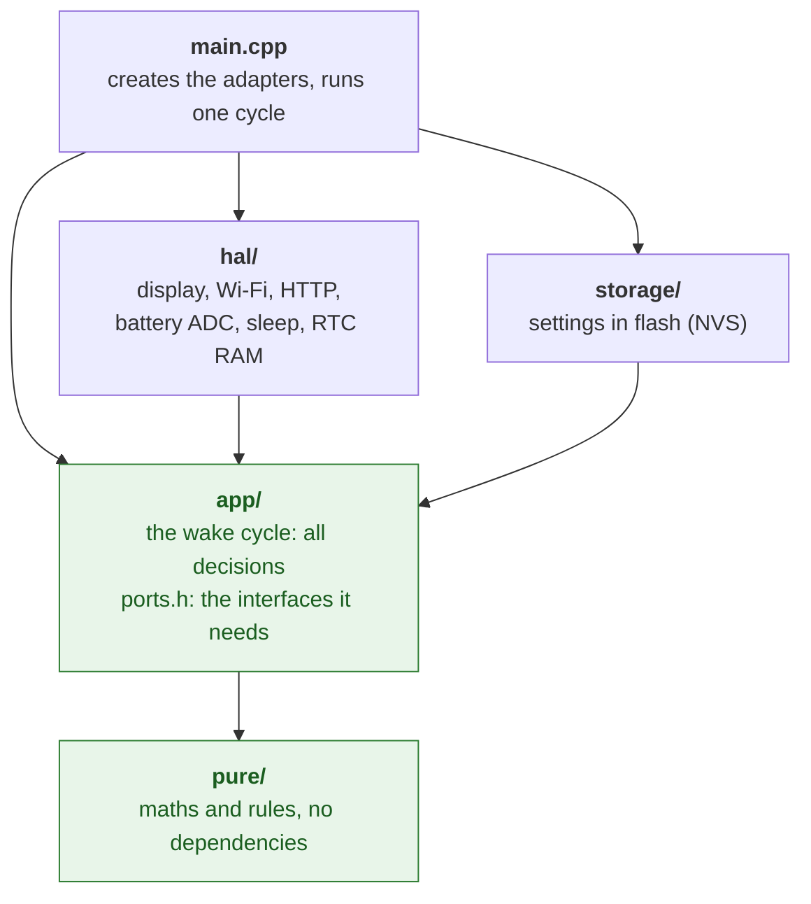
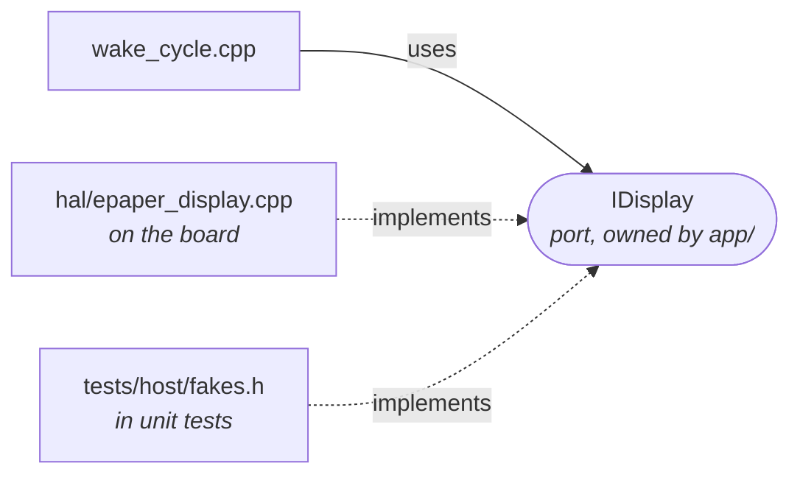
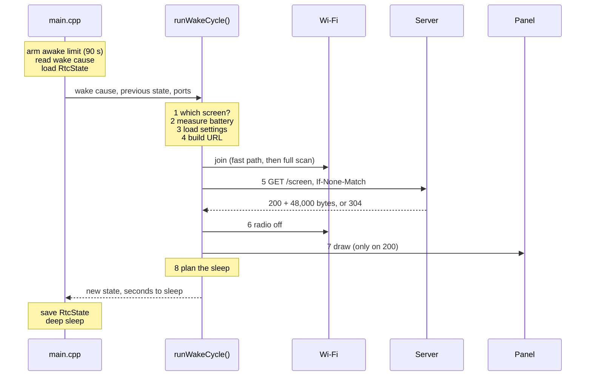

# Architecture

How the firmware is put together, and why. Every named idea is indexed in [PATTERNS.md](PATTERNS.md).

## The one idea: be asleep

With Wi-Fi on, an ESP32 draws roughly 100 mA. In deep sleep it draws microamps. A 2000 mAh battery lasts under a day in the first state and months in the second.

```
current
 ~100 mA |  ██                                  ██
         |  ██                                  ██
   ~µA   |__██__________________________________██______
            ~10 s          sleep: 30 min        ~10 s
            wake cycle                          wake cycle
```

So the firmware is a program that sleeps and occasionally runs one short pass, the **wake cycle**. Two consequences shape everything else:

| Consequence | Meaning |
| --- | --- |
| Every wake is a reboot | Deep sleep powers down CPU and RAM. The program starts from the top with all variables reset. What must be remembered is stored somewhere that survives. |
| Work moves off the device | Rendering text, laying out a calendar and calling weather services cost awake time. A server does it and hands over a finished image. |

## Layers



An arrow means "may include". Arrows only point down. The green layers include no Arduino or ESP-IDF header, so they are unit tested on a computer.

| Folder | Contains | Tested |
| --- | --- | --- |
| `pure/` | Battery maths, button decoding, navigation, refresh policy, HTTP date, sleep plan, state checksum, URL building | Host unit tests |
| `app/` | `runWakeCycle()` and the interfaces it talks through (`ports.h`) | Host unit tests, with fakes |
| `hal/` | One adapter per piece of hardware; `board.h` holds all pin numbers | On the board |
| `storage/` | Settings in NVS | On the board |
| `main.cpp` | Wiring only | On the board |

**Why:** hardware code can only be tested on hardware, slowly and by hand. So it is kept thin (read a pin, send a buffer) and every decision lives in code that runs anywhere. The host test build compiles only `pure/` and `app/`; a hardware header sneaking in breaks that build.

### Ports and adapters

The wake cycle knows only the small interfaces in `app/ports.h`. `main.cpp` decides what gets plugged in.



The six ports: `IBatteryAdc`, `IDisplay`, `INetwork`, `IScreenClient`, `ISettings`, `IWallClock`.

## The wake cycle

Code: [`firmware/src/app/wake_cycle.cpp`](../firmware/src/app/wake_cycle.cpp). One successful cycle, in time order:



| Step | Why it is done this way |
| --- | --- |
| 1 Which screen | Navigation is relative to the screen on the panel. It becomes the "shown" screen only after a successful draw, so state cannot drift from reality. |
| 2 Battery | Before Wi-Fi: radio bursts pull the voltage down and would skew the reading. |
| 3 Settings | If none, a notice is drawn once, not on every wake. E-paper keeps its image for free. |
| 4 URL, then Wi-Fi | Cheap checks first. Never pay for the radio if the request cannot be built. |
| 5 Conditional GET | `304` means unchanged: no download and, more important, no panel refresh. |
| 6 Radio off | Before drawing. A refresh takes seconds and does not need the radio. |
| 7 Draw | Only for `200` with exactly 48,000 bytes. For a raw bitmap the size is the whole validity check. |
| 8 Sleep plan | Server hint or default on success, exponential backoff on failure. A long outage must not drain the battery. |

The **awake limit** forces sleep after 90 s whatever happens.

## Where state lives

| Data | Where | Survives sleep | Survives power loss | Write cost |
| --- | --- | --- | --- | --- |
| Per-wake state: shown screen, ETag, failure count, Wi-Fi hint, low-battery flag | RTC RAM (`RtcState`) | yes | no | free |
| Settings: Wi-Fi credentials, server address | Flash (NVS) | yes | yes | wears the flash |
| Everything else | Normal RAM | no | no | free |

`RtcState` is guarded by a magic number, a layout version and a CRC-32. If any of them is wrong, the firmware starts from clean defaults. See [`pure/rtc_state.h`](../firmware/src/pure/rtc_state.h).

## Flash layout

16 MB, defined in [`firmware/partitions.csv`](../firmware/partitions.csv):

```
0         0x10000          0x310000         0x610000                      0xFF0000  16 MB
├─────────┼────────────────┼────────────────┼─────────────────────────────┼────────┤
│ boot    │ app0           │ app1           │ ffat                        │ core   │
│ nvs     │ firmware A     │ firmware B     │ offline screen cache        │ dump   │
│ otadata │ 3 MB           │ 3 MB           │ 9.9 MB (reserved)           │ 64 kB  │
└─────────┴────────────────┴────────────────┴─────────────────────────────┴────────┘
```

Two firmware slots make over-the-air updates safe: the update goes into the idle slot, then the board switches. OTA and the cache are not in v0.1, but the layout is, because changing it later needs a USB re-flash.

## Build and versions

Everything is pinned in [`firmware/platformio.ini`](../firmware/platformio.ini): the platform release (Arduino-ESP32 core 3.3.9) and the display library (an exact commit). The version string comes from `git describe` at build time and is sent to the server with every request.

## Decisions

| Decision | Reason | Alternative |
| --- | --- | --- |
| Server renders, device displays | Shortest awake time; fonts, layout and API keys stay off the device | Rendering on the device: weeks of battery become days |
| Raw 1-bit bitmap, 48,000 bytes | No decoder, no decode memory, validity is a size check | PNG: smaller on the wire, needs a decoder and RAM |
| ETag and `304` | Standard HTTP, works with any server or cache | A custom hash parameter |
| Clock from the HTTP `Date` header | Already in every response | NTP: one more request, more radio time |
| Device owns the screen order | Simple request, works offline-first | Server-driven navigation: new screens without re-flashing. Worth revisiting when the server exists. |
| Result structs, no exceptions | Usual for embedded C++: smaller binary, visible error paths | Exceptions |
| Hand-written mini test framework | Tests need only a compiler, and it shows how a framework works | GoogleTest, doctest: more features, one more dependency |
| RTC pull-ups, RTC peripherals on during sleep | The documented, safe way to stop the key pins floating | Pad "hold" with peripherals off: lower sleep current, to try once current is measured |

## Not in v0.1

HTTPS, OTA updates, Wi-Fi provisioning, long-press gestures, partial refresh, docked mode, the offline cache. Each has a place waiting: a new adapter behind a new port, a new rule in `pure/`.
