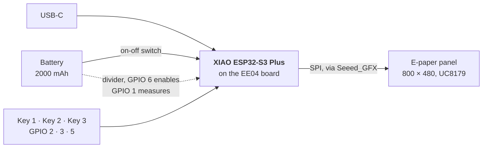

# Hardware notes

Facts about the board that the firmware relies on. In code they live in [`firmware/src/hal/board.h`](../firmware/src/hal/board.h) and [`firmware/include/driver.h`](../firmware/include/driver.h).

## The kit

Seeed Studio TRMNL 7.5" (OG) DIY Kit:

- XIAO ePaper Display Board (EE04) carrying a XIAO ESP32-S3 Plus (16 MB flash, OPI PSRAM)
- 7.5" monochrome e-paper panel, 800 × 480, UC8179 controller
- 2000 mAh Li-ion battery
- 3 keys, a reset button, an on-off switch



## Keys

Looking at the screen, left to right:

```
   ┌─────────┐   ┌─────────┐   ┌─────────┐
   │  KEY 1  │   │  KEY 2  │   │  KEY 3  │
   └─────────┘   └─────────┘   └─────────┘
      home          next          prev
     GPIO 2        GPIO 3        GPIO 5
     pin D1        pin D2        pin D4
```

- Active low: a pressed key reads 0.
- The assignment is one table, `kButtons` in `board.h`. To change what a key does, edit that table and nothing else.
- **BOOT** (for uploads) is not one of these: it is the tiny button on the XIAO module, next to the USB-C socket.

## Pin map

| Function | GPIO | XIAO pin | Notes |
| --- | --- | --- | --- |
| Key 1, 2, 3 | 2, 3, 5 | D1, D2, D4 | See above |
| Battery voltage (ADC) | 1 | D0 | Reads half the battery voltage |
| Battery divider enable | 6 | D5 | HIGH connects the divider. LOW otherwise. |
| Display SPI and control | | | Inside Seeed_GFX, selected by `driver.h` |

Key and battery pins were confirmed on our unit on 2026-10-05 with a test sketch.

## Battery measurement

A full cell is 4.2 V, too much for the ADC pin, so two equal resistors halve it. A switch disconnects them when idle, so they do not drain the cell.

```
battery + ──[ switch: GPIO 6 ]──[ R ]──┬──[ R ]── GND
                                       │
                                 GPIO 1 (ADC): half the battery voltage
```

```
voltage = raw / 4095 × 3.6 V × 2 × 0.968
          │            │       │     └─ calibration factor
          │            │       └─ undo the divider
          │            └─ ADC full scale
          └─ 12-bit reading, 0 to 4095
```

- The factor 0.968 comes from another project for the same kit. **Not yet checked against a multimeter on our unit.**
- One reading: 11 samples, drop the 2 highest and 2 lowest, average the rest.
- Voltage to percent: a Li-ion discharge table in `pure/battery_math.cpp`.

## Display

- `driver.h` must define `BOARD_SCREEN_COMBO 502` and `USE_XIAO_EPAPER_DISPLAY_BOARD_EE04`. Confirmed on our unit with Seeed's HelloWorld example.
- The panel is 1-bit: black or white. Gray is made by dithering on the server.
- A full refresh flashes and takes a few seconds. Partial refresh leaves ghosting; other firmware for this panel found fading after about 3 partial updates. v0.1 only does full refreshes.
- A separately installed TFT_eSPI library conflicts with Seeed_GFX in the Arduino IDE (blank screen). The PlatformIO build uses its own pinned copy of Seeed_GFX.

## Handling

- **Never connect or disconnect the display ribbon cable while the board is powered.**
- The ribbon cable is fragile. The metal contacts face up.
- Connect the battery with USB unplugged. Red wire to the `+` marking.
- **The on-off switch connects the battery.** With the switch off the board runs on USB and stops the moment the cable is pulled.

## Not yet known

- Sleep current in deep sleep.
- Whether the firmware can detect USB power (needed for a docked mode).
- How many partial refreshes our own panel tolerates.
