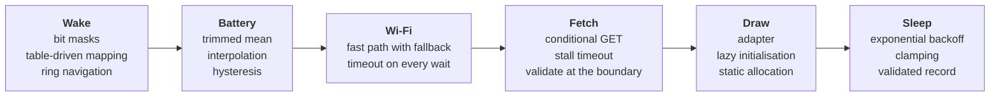

# Patterns and algorithms

Every reusable idea in this firmware: what it is, why it is used here, where to read it. The comment at that place explains it in context, often with a small diagram.

A **pattern** is a named, proven way to organise code. An **algorithm** is a step-by-step method for computing something. None of them is specific to this project; you will meet them all again.

## One wake cycle, and the ideas it uses

Around all of it: duty cycling, ports and adapters, a dead man's switch.

## Architecture patterns

| Pattern | The idea | Why here | Where |
| --- | --- | --- | --- |
| Duty cycling (run to completion) | Sleep by default; wake, do one pass, sleep again. | Battery life is set by the time spent awake. | `app/wake_cycle.h` |
| Layered architecture | Layers are stacked; dependencies only point down. | Hardware code cannot leak into logic. | `main.cpp`, [ARCHITECTURE.md](ARCHITECTURE.md) |
| Functional core, imperative shell | Decisions in side-effect-free functions; a thin shell does the I/O. | The core is easy to test; the shell has little to test. | `pure/` versus `hal/` |
| Pure function | Same inputs, same output; no globals, no hardware. | Each case is a one-line test. | `decideRefresh()` in `pure/refresh_policy.h` |
| Ports and adapters (hexagonal) | The app defines interfaces for what it needs; implementations plug in. | The same cycle runs on the board and in tests. | `app/ports.h` |
| Dependency inversion | High-level and low-level code both depend on an interface the high-level side owns. | The Wi-Fi adapter depends on the app, not the other way round. | `app/ports.h` |
| Dependency injection | A function is handed its collaborators and never creates them. | Tests hand in fakes, `main.cpp` hands in hardware. | `Ports` in `app/wake_cycle.h` |
| Composition root | One place creates and wires all concrete objects. | Everything hardware-specific is visible in one file. | `main.cpp` |
| Adapter (wrapper) | A small class translates the interface you want into the one a library offers. | Swapping the display library touches one file. | `hal/epaper_display.h` |
| Humble object | Make hard-to-test code too simple to need tests. | The battery adapter only reads samples; the maths is elsewhere. | `IBatteryAdc` in `app/ports.h` |
| Interface segregation | Many small interfaces beat one big one. | One or two methods per port; fakes stay tiny. | `app/ports.h` |
| Link seam | One declaration, two definitions; the build picks one. | Logging is called everywhere; passing a logger around would be noise. | `app/log.h` |
| State in, state out | A function takes the old state and returns the new one. | The cycle does not know where state is stored; tests read "given, expect". | `runWakeCycle()` |
| Single source of truth | Each fact is written down in exactly one place. | Pins, frame size and version cannot disagree with themselves. | `hal/board.h`, `pure/frame.h`, `scripts/git_version.py` |

## Reliability patterns

| Pattern | The idea | Why here | Where |
| --- | --- | --- | --- |
| Timeout on every wait (polling with a deadline) | Ask "done yet?" in a loop and give up after a limit. | A stuck wait with the radio on empties the battery. | `waitUntilConnected()` in `hal/wifi_network.cpp` |
| Stall timeout | Give up after a time without progress, not after a total time. | A slow download is fine; a silent one is not. | `readBody()` in `hal/http_screen_client.cpp` |
| Dead man's switch (watchdog) | A timer forces a safe state unless everything finishes in time. | Catches the hang nobody anticipated. | `armAwakeLimit()` in `hal/power.h` |
| Exponential backoff | Double the wait after each failure in a row, up to a cap. | Quick recovery from a hiccup, low cost in an outage. | `pure/sleep_plan.h` |
| Saturating counter | A counter that stops at its maximum and never wraps to zero. | Failure 256 must not look like failure 0. | `finishFailed()` in `app/wake_cycle.cpp` |
| Single exit helper | Every failure path ends in one function. | Counter and backoff are handled in exactly one place. | `finishFailed()` in `app/wake_cycle.cpp` |
| Fast path with fallback | Try the quick way that usually works, then the slow way that always works. | Wi-Fi with a remembered channel, then a full scan. | `hal/wifi_network.cpp` |
| Validated persistent record | Guard stored data with a magic number, a version and a checksum. | Memory that survives a reboot can be stale or corrupt. | `pure/rtc_state.h` |
| Validate at the boundary | Check data where it enters or leaves the program. | Image size on the way in, URL characters on the way out. | `hal/http_screen_client.cpp`, `pure/screen_request.h` |
| Validate before you pay | Cheap checks before expensive work. | `Content-Length` before the download; the URL before Wi-Fi. | `hal/http_screen_client.cpp`, `app/wake_cycle.cpp` |
| Result struct, no exceptions | The return value says what happened. | Exceptions are normally off in embedded C++. | `FetchResult` in `app/ports.h` |
| A/B firmware slots | Two firmware regions; update the idle one, then switch. | A failed update leaves the working firmware intact. | `firmware/partitions.csv` |
| Reproducible build | Pin every dependency to an exact version. | The same source gives the same binary next year. | `firmware/platformio.ini` |

## Embedded techniques

| Technique | The idea | Where |
| --- | --- | --- |
| Static allocation | Reserve big fixed-size buffers at build time, not from the heap. | `g_frame` in `main.cpp` |
| Lazy initialisation | Create an expensive object on first use. | `panel()` in `hal/epaper_display.cpp` |
| Caller-provided buffer with capacity | A function writes into memory the caller owns and is told its size. | `buildScreenUrl()` in `pure/screen_request.h` |
| Integer maths, no floating point | Multiply first, divide last, write fractions as ratios. | `adcRawToMillivolts()` in `pure/battery_math.cpp` |
| Wrap-safe elapsed time | `now - start < timeout` stays correct when the counter overflows. | `waitUntilConnected()` in `hal/wifi_network.cpp` |
| Compile-time checks | `constexpr`, `static_assert` and `#error` stop a wrong build for free. | `pure/frame.h`, `pure/rtc_state.h`, `hal/epaper_display.cpp` |
| Named constants | No bare numbers in logic; each has a name and a reason. | `config.h` |
| RTC memory versus flash | Fast-changing state in RTC RAM, rare settings in flash. | `pure/rtc_state.h`, `storage/nvs_settings.h` |
| Switched voltage divider | Halve the battery voltage for the ADC; disconnect the divider when idle. | `hal/battery_adc.cpp` |
| RTC-domain pull-ups | Keys that wake the chip need pull-ups that work in deep sleep. | `enterDeepSleep()` in `hal/power.cpp` |
| Conditional write | Compare before writing; skip the write if nothing changed. | `applyDevSecrets()` in `storage/nvs_settings.cpp`, `scripts/git_version.py` |

## Algorithms

| Algorithm | What it computes | Where |
| --- | --- | --- |
| Trimmed mean | An average that ignores the highest and lowest samples. | `trimmedMean()` in `pure/battery_math.cpp` |
| Insertion sort | A handful of values sorted the simplest way there is. | inside `trimmedMean()` |
| Lookup table with linear interpolation | A curve (battery voltage to charge) from a few measured points. | `millivoltsToPercent()` in `pure/battery_math.cpp` |
| Hysteresis | A flag with separate on and off thresholds, so it does not flicker. | `updateLowBatteryFlag()` in `pure/battery_math.h` |
| Bit masks | A set of pins as one number, one bit per pin. | `pure/buttons.cpp` |
| Table-driven mapping | Behaviour as rows of data, not branches of code. | `kButtons` in `hal/board.h` |
| Modular arithmetic (ring) | Wrap-around navigation with the remainder operator. | `navigate()` in `pure/screens.cpp` |
| Days from civil date | Calendar date to day count in pure integer arithmetic. | `daysFromCivil()` in `pure/http_date.cpp` |
| Strict fixed-format parsing | Parse by position; reject anything unexpected. | `parseHttpDate()` in `pure/http_date.cpp` |
| CRC-32 | A checksum that changes if any bit of the data changes. | `crc32()` in `pure/rtc_state.h` |
| Clamping | Force a value into an allowed range. | `planSleepSeconds()` in `pure/sleep_plan.cpp` |

## Protocol ideas

| Idea | What it does | Where |
| --- | --- | --- |
| Conditional GET (ETag, `If-None-Match`, `304`) | "Send it only if it changed." | step 5 in `app/wake_cycle.cpp`, [SERVER_CONTRACT.md](SERVER_CONTRACT.md) |
| Clock from the `Date` header | Time sync without NTP. | `pure/http_date.h` |
| Raw fixed-size payload | A format with no parser: validity is a size check. | `pure/frame.h` |

## Testing techniques

| Technique | The idea | Where |
| --- | --- | --- |
| Host unit tests | Run the device's logic on a computer, in milliseconds. | `firmware/tests/host/` |
| Test doubles (fakes) | Stand-ins that script the outside world and record what was done to them. | `tests/host/fakes.h` |
| Test fixture | Shared set-up in one struct; each test shows only its difference. | `Rig` in `tests/host/test_wake_cycle.cpp` |
| Self-registering tests | Each test adds itself to a list before `main()` runs. | `tests/host/mini_test.h` |
| Known-answer test | Check an algorithm against a published reference value. | CRC-32 and HTTP-date tests in `tests/host/test_pure_misc.cpp` |
| Property test | Check a rule that must hold for every input. | `percent_never_decreases_as_voltage_rises` in `tests/host/test_battery_math.cpp` |
| Sanitizers | Compiler-inserted run-time checks for memory errors and undefined behaviour. | `tests/host/CMakeLists.txt` |
| Warnings as errors | The strictest warnings, and none allowed. | `tests/host/CMakeLists.txt` |
| Static analysis | A tool reads the code for bugs without running it. | `.github/workflows/ci.yml` |

## Naming and code rules

Names are part of the teaching too: see the tables in [CONTRIBUTING.md](../CONTRIBUTING.md#names).

## Adding to this list

A change that brings a new pattern or algorithm adds a row here and a short comment where it is used. That is part of the definition of done.
