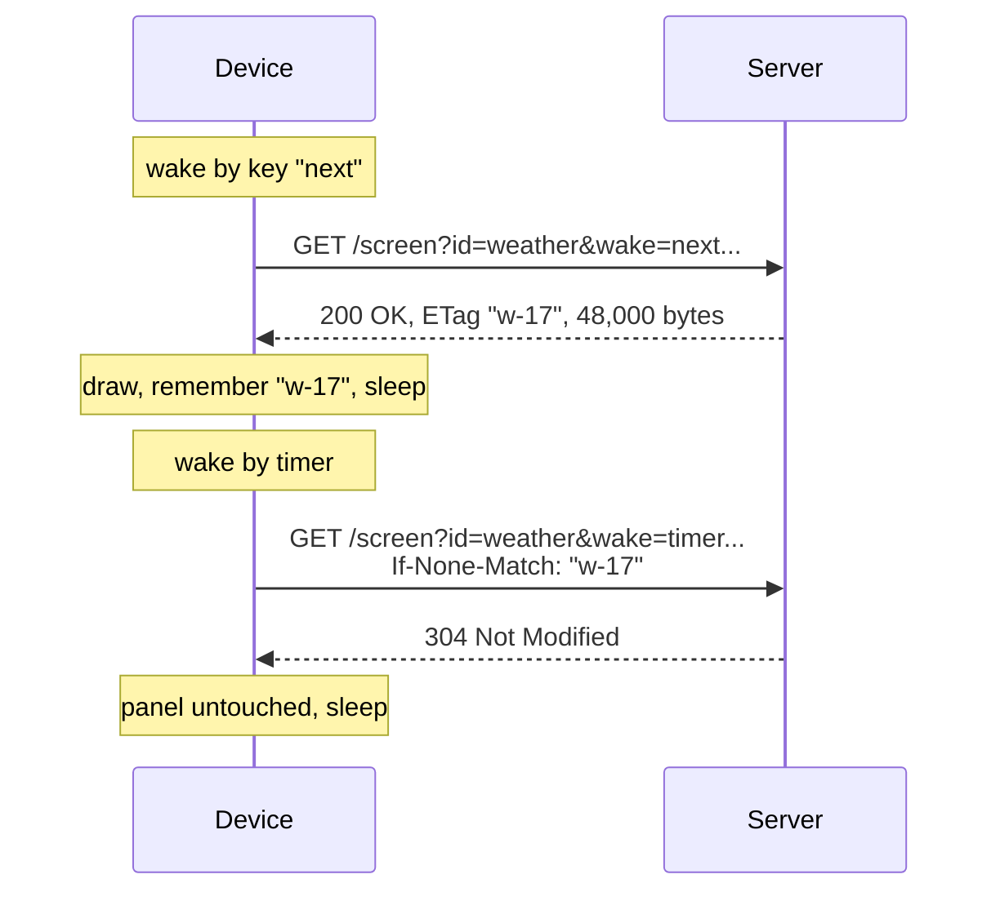

# Server contract

The complete interface between the firmware and the server: what the device asks for and what it expects back.

**Status: proposed (v0).** The real server does not exist yet. This is what the firmware implements; change both together.



## Request

```
GET {server}/screen?id=home&bat_mv=3940&bat_pct=68&low=0&fw=v0.1.0&wake=timer
If-None-Match: "abc123"          (only when the device already shows this screen)
```

| Parameter | Example | Meaning |
| --- | --- | --- |
| `id` | `home` | Screen: `home`, `time-left`, `year-dots`, `night-sky`, `family-week`, `weather` or `word` |
| `bat_mv` | `3940` | Battery voltage in millivolts |
| `bat_pct` | `68` | Battery charge, 0 to 100 |
| `low` | `0` | `1` when the battery is low (on at 8 % or less, off at 12 % or more) |
| `fw` | `v0.1.0` | Firmware version, from `git describe` |
| `wake` | `timer` | Why the device woke: `boot`, `timer`, `prev`, `home` or `next` |

- Values use only `A-Z a-z 0-9 . _ -`, so nothing is percent-encoded.
- After a key press the device asks for a different screen and sends no ETag.

## Response: the image changed, or no ETag was sent

```
HTTP/1.1 200 OK
Content-Type: application/octet-stream
Content-Length: 48000
ETag: "def456"
Date: Mon, 05 Oct 2026 15:07:00 GMT
X-Next-Wake: 1800

<48,000 bytes>
```

| Header | Required | Rule |
| --- | --- | --- |
| `Content-Length` | **yes** | Must be `48000`. A response without it (chunked encoding) is rejected. |
| `ETag` | recommended | At most 47 characters, quotes included. Changes whenever the image changes; differs between screens. Without it the device redraws on every wake. |
| `Date` | recommended | Standard HTTP date; the device sets its clock from it. Most web servers add it. |
| `X-Next-Wake` | optional | Seconds until the next wake. The device clamps it to 60 … 86,400 and uses 30 minutes without it. |

### The body: a raw 1-bit bitmap

```
            byte 0     byte 1            byte 99
           ┌────────┬────────┬── ··· ──┬────────┐
row 0      │76543210│76543210│         │76543210│    800 pixels = 100 bytes
row 1      │        │        │         │        │
  ···                                                bit 7 = leftmost pixel
row 479    │        │        │         │        │    1 = white, 0 = black
           └────────┴────────┴── ··· ──┴────────┘
            480 rows × 100 bytes = 48,000 bytes, no header, no compression
```

Pixel (x, y) is bit `7 - x % 8` of byte `y × 100 + x / 8` (integer division).

## Response: nothing changed

```
HTTP/1.1 304 Not Modified
ETag: "abc123"
Date: Mon, 05 Oct 2026 15:37:00 GMT
X-Next-Wake: 1800
```

No body. Only valid as an answer to a request that carried `If-None-Match`.

## Errors

Any other status, a wrong body size, or no answer is a failed cycle. The device keeps the old image and retries with exponential backoff; the first success resets it.

| Failures in a row | 1 | 2 | 3 | 4 | 5 | 6 | 7 and more |
| --- | --- | --- | --- | --- | --- | --- | --- |
| Wait in minutes | 1 | 2 | 4 | 8 | 16 | 32 | 60 |

## Transport

Plain `http://` in v0.1, for a server on the home network. HTTPS is planned.

## A server for testing

[`tools/test_server.py`](../tools/test_server.py) implements this contract with test images, using only Python 3:

```sh
python3 tools/test_server.py
```

It prints the address for `firmware/include/secrets.h`, then one line per request. Each screen has its own image and ETag, so asking twice for the same screen gives `200`, then `304`. What the test image shows: [OPERATIONS.md, section 5](../OPERATIONS.md#5-first-run-on-the-hardware).
